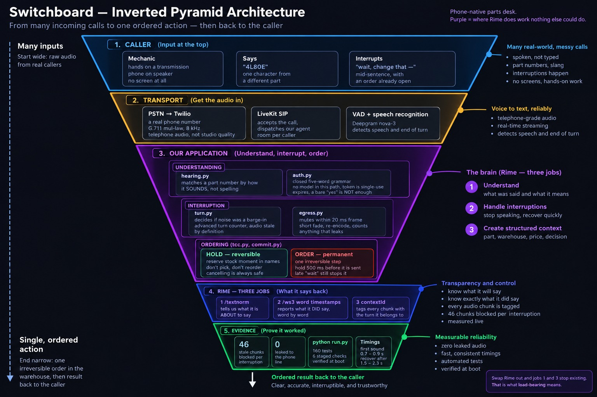
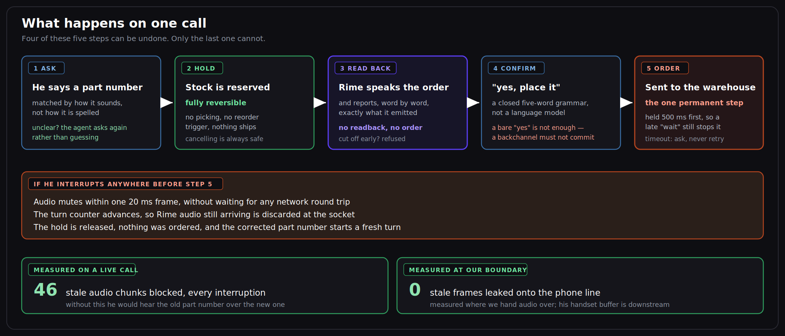

# Switchboard

**A parts desk you can phone. It takes your order, reads it back, and still
gets it right when you interrupt it halfway through.**

<p align="center">
  
</p>

---

## Executive summary

Switchboard is a voice agent for an auto-parts counter, reachable on a real
phone number, built for a caller whose hands are busy and who has no screen in
front of him. It takes a spoken part number, places a **reversible** hold on
stock, has Rime read the order back, and only sends the order to the warehouse
once the caller confirms — so a correction made mid-sentence can never leave a
wrong order behind. Rime does three distinct jobs here, not one: it tells us
what it is **about to** say (so the order is tied to the words the caller
actually hears rather than the text we typed), it reports what it **did** say
word by word (so nothing is ordered that was never read aloud), and it tags
audio with an epoch (so superseded speech is discarded at the socket rather
than reaching the caller's ear). On live calls we measured **46 stale audio
chunks blocked per interruption** and **zero stale frames leaking** to the
phone line, and every number in this README is reproducible with a single
command, `python run.py`, which runs 160 automated checks and verifies our
Rime configuration against Rime's live voice catalog at startup.

---

## Demo Video

A short demonstration of the process segmentation and automation pipeline:

[▶️ Watch the demo video](https://drive.google.com/file/d/1N33-wHxfLZOb3HY0e0kpssBttDIFmRrr/view?usp=sharing)

## Contents

| | |
|---|---|
| [The problem](#the-problem) | who is calling, and why a screen is no help |
| [How a call works](#how-a-call-works) | the five steps, and which one is permanent |
| [Where Rime does the work](#where-rime-does-the-work) | the three jobs, with a worked example |
| [The hard part](#the-hard-part-interruption) | interruption, and what happens in the first 20 ms |
| [When it mishears](#when-it-mishears) | real ASR failures and how we handle them |
| [Results](#results) | what we measured, on live calls |
| [Run it yourself](#run-it-yourself) | setup, in order |
| [Repository map](#repository-map) | what each file does |
| [Scope](#scope) | what we have *not* proved |

---

## The problem

A mechanic phones a parts counter. His hands are on a transmission, the phone
is on speaker across the bay, and an impact wrench is running. He orders by
part number.

```
4L80E      ← transmission A
4L60E      ← transmission B
```

One character apart. Wrong number, wrong part ships, and somebody drives back
across town. There is no screen in this job, which is the whole reason it is a
phone call — remove speech and there is no product, only a website he already
cannot use.

**The hard bit is not understanding him. It is what happens when he changes
his mind halfway through the agent's sentence.**

---

## How a call works

<p align="center">
  
</p>

The important property: **steps 1–4 can all be undone.** Only step 5 is
permanent, and it is held in escrow for 500 ms so that a barge-in arriving a
moment later still aborts it before the request leaves the network card.

---

## Where Rime does the work

Rime is not a text-to-speech pipe bolted onto the end. It is load-bearing in
three places, and removing it would break two of them outright.

### 1. It tells us what it is *about* to say

This is the part most people do not expect. What we write is **not** what the
caller hears:

| | |
|---|---|
| **We send Rime** | `3 of spell(4L80E). Total $412.59.` |
| **Rime speaks** | `three of four, L, eight zero, E. Total four hundred twelve dollars fifty nine cents.` |

Nothing we typed survives to the ear. So before speaking, we ask Rime's
`/textnorm` endpoint what it is going to say, and we tie the order's
authorization to **that** string — the words the caller will actually hear.

Binding the order to the text we wrote would be binding it to something nobody
ever heard.

> Called at transaction-mutation time and cached, never on the speech path, so
> it costs nothing in response latency.

### 2. It reports what it *did* say

Rime's `/ws3` WebSocket returns word-level timestamps as it speaks. We record
them, and the order will not go through unless those words include the part
number and the total.

**No readback, no order.** If synthesis was cut off before the price was
spoken, authorization is refused.

### 3. It lets us cut it off cleanly

Every chunk of audio carries a `contextId` naming the conversational turn it
belongs to. When the caller interrupts, we advance the turn counter, and any
chunk still arriving from the old turn is discarded at the socket — before it
can reach the playout buffer.

---

## The hard part: interruption

The caller says *"wait — change that"* while the agent is mid-sentence and a
reservation is already open. Four things have to happen, in this order:

| When | What |
|---|---|
| **within 20 ms** | Audio to the caller mutes. A short fade on decoded audio, re-encoded — so the stream never actually gaps. |
| **same instant** | The turn counter advances. Every in-flight chunk is now stale by definition. |
| **asynchronously** | Rime is told to stop. **The mute never waits for this round trip.** |
| **within 500 ms** | If an order was about to be placed, the escrow aborts it before dispatch. |

The design rule underneath all of it: **correctness never depends on a network
message arriving in time.** The mute is local and immediate; the remote
cancellation is an optimisation.

---

## When it mishears

Speech recognition on a phone line gets identifiers wrong in ways an alias
table cannot cover. These are real transcripts from our own calls:

| He said | The computer heard | Why |
|---|---|---|
| `4L80E` | `4 L A T E` | "eighty" written as the word *ate* |
| `4L80E` | `4 8 o l e` | letters and digits transposed |
| `yes place it` | `"yes."` then `"place it."` | he paused; neither half is a command |

Our approach:

- **Match on sound, not spelling.** A part number is reduced to a phonetic
  skeleton and compared by similarity. `4 L A T E` resolves to `4L80E`.
- **Ask rather than guess.** Below a confidence floor the agent asks again.
  Ordering the wrong part because a match was *close enough* is worse than one
  extra turn.
- **Stitch sentences back together.** A six-second rolling window joins
  fragments, so a pause mid-command does not lose the command. The window is
  deliberately short, so a stale *"yes"* cannot pair with a much later
  *"place it"*.
- **A bare "yes" never places an order.** It is an acknowledgement, not an
  authorization. A backchannel must not commit money.

---

## Results

Measured on live calls and against the live Rime API, `mistv3` / `astra` /
`eng`, G.711 mu-law at 8 kHz, five runs.

| | |
|---|---|
| **Stale audio chunks blocked per interruption** | **46 – 47** |
| **Stale frames leaked to the phone line** | **0** |
| Time to first sound (cold / warm) | 0.73 – 0.93 s / 0.71 – 0.92 s |
| Time to recover after an interruption | 1.5 – 2.3 s |
| `/textnorm` latency (off the speech path) | 1.2 – 1.6 s |
| Automated checks | 160 passing |

Cold and warm starts are reported separately rather than averaged together.

**On speed control:** Rime offers two. We tested both on live calls.
`timeScaleFactor` changed duration by +136 % to +147 % at 1.6, in the same
direction on every run. `inlineSpeedAlpha` moved it by under 6 % with the
direction flipping between runs — that is measurement noise, not control, so
we ship the first and do not claim the second.

---

## Run it yourself

### 1. Install

```bash
python -m venv .venv
source .venv/bin/activate        # Windows: .venv\Scripts\activate
pip install -r requirements.txt
```

### 2. Check everything, no API key needed

```bash
python run.py
```

Six stages: environment, 160 tests, adversarial race conditions, the Rime
preflight, the interruption stress case, and a report against the judging
rubric. This works fully offline.

### 3. Add a Rime key and hit the live API

```bash
cp .env.example .env             # then paste your key into RIME_API_KEY
python run.py live
```

Opens a real WebSocket to Rime, measures time-to-first-audio cold and warm,
confirms word timestamps arrive, and verifies the speaker exists in Rime's
live catalog.

### 4. Other commands

| Command | What it does |
|---|---|
| `python run.py test` | the full test suite |
| `python run.py chaos` | transaction and interruption race conditions only |
| `python run.py demo` | the 90-second interruption stress case |
| `python run.py speed` | the two speed controls, measured side by side |
| `python run.py preflight` | live catalog check and secret scan |
| `python -m switchboard.agent dev` | start the phone agent |

### 5. Take a real call

Needs a LiveKit account and a phone number routed to it. Fill `LIVEKIT_*` in
`.env`, start the agent, and dial the number.

---

## Repository map

```
run.py                     one command, six stages
src/switchboard/
  agent.py                 LiveKit entry point — the phone leg
  rime.py                  our Rime client: /ws3, /textnorm, /oov, catalog
  render.py                builds the readback and its normalised form
  hearing.py               phonetic matching, multi-turn commands
  turn.py                  barge-in decision, epoch advance
  egress.py                audio out, mute, fade, leak probe
  auth.py                  closed grammar, single-use token
  tcc.py                   reservation: try / confirm / cancel
  commit.py                500 ms escrow, reconciliation
  ulaw.py                  G.711 codec (Python 3.13 removed the stdlib one)
eval/
  judge.py                 rubric-by-rubric report
  live.py                  real /ws3 smoke test
  speed.py                 controlled speed-control experiment
  acoustic.py              far-end residue measurement
  demo.py / preflight.py   stress case, eligibility checks
tests/                     160 assertions
docs/                      the diagrams in this README
```

**Third-party services:** Rime (speech out), LiveKit Agents (orchestration and
SIP), Deepgram nova-3 (speech in), Twilio (phone number). No LLM anywhere in
the path that places an order.

---

## Scope

Stated here and printed by the tool on every run, so nobody has to go looking.

- **Frame counts are measured where our system hands audio to the phone line.**
  The caller's own handset buffer is downstream of that point. We built and
  validated a tool to measure the far end (`python run.py acoustic`, checked
  against 13 synthetic calls with known answers), but running it at scale needs
  many paid international calls.
- **The warehouse is a stand-in.** The ordering protocol is real and tested;
  the inventory system behind it is in-memory with a synthetic catalog.
- **Speech recognition sits upstream of our grammar,** so its error rate bounds
  ours. That is why low-confidence matches ask again instead of guessing.
- **Call volume is limited by cost, not capability.** Indian numbers require
  company registration and regulatory KYC, so we used a US number — every test
  call is an international call paid out of pocket.

### Failure behaviour

| If this fails | The agent |
|---|---|
| Rime `/textnorm` unreachable | refuses to read back, places nothing |
| Word timestamps missing | refuses authorization — never assumes it spoke |
| Confirm times out | queries state and reconciles; never blind-retries |
| Part number unclear | asks again rather than guessing |
| Caller interrupts during commit | aborts before dispatch, releases the hold |

---

## Evidence

`RIME_EVIDENCE.md` holds the hard voice claim, the acceptance test defined
before the demo, the procedure, the measured results, and the limitations.